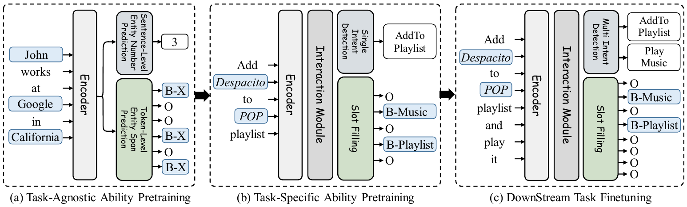

# _Decoupling breaks data barriers:_ A  Decoupled Pre-training Framework for Multi-Intent Spoken Language Understanding

---

<p align="center">
  	<a href='https://arxiv.org/pdf/2403.18814.pdf'></a>
  <a href=""></a>
  <a >
       
  	</a>
   	<a>
       
  	</a>
  	<a href="https://github.com/LightChen233/OpenSLU/network/members">
       
  	</a>
    <br />
</p>

<div>


</div>

> 🔥 Official implementation for "[_Decoupling breaks data barriers:_ A  Decoupled Pre-training Framework for Multi-Intent Spoken Language Understanding]()".



##  Reference

If you find this project useful for your research, please consider citing the following paper:

```
@inproceedings{qin-etal-2024-dpf,
    title = "Decoupling breaks data barriers: A  Decoupled Pre-training Framework for Multi-Intent Spoken Language Understanding",
    author = "Qin, Libo  and
      Chen, Qiguang  and
      Zhou, Jingxuan  and
      Li, Qinzheng  and
      Lu, Chunlin  and
      Che, Wanxiang",
    booktitle = "Proc. of IJCAI 2024",
}
```


##  Installation
### System requirements
DPF requires `Python>=3.8`, and `torch>=1.12.0`.
### Install from git
```bash 
git clone https://github.com/LightChen233/DPF.git && cd DPF/
pip install -r requirements.txt
```

### Downloading Pretrained Model
Due to the restrictions of the open source agreement, we cannot open source the pre-training data. However, you can download our pre-trained models from different stages at  [TAAP](https://huggingface.co/LightChen2333/deberta-v3-dpf-taap) and [TSAP](https://huggingface.co/LightChen2333/deberta-v3-dpf-tsap).

Please put the model in the `save/dpf/taap/ckpt-155000` and `save/dpf/tsap/ckpt-45000` directories.
##  Pre-Training (Optional)

### 1. Collecting Data
**Download:** Due to the restrictions of the open source agreement, we cannot distribute the integrated results. Please download the dataset at the url provided in the original paper.

**Process:** Please process it into [OpenSLU](https://github.com/LightChen233/OpenSLU) format.

**Position:**
- Please put TAAP data in the following paths: `dataset/taap/train.jsonl` and `dataset/taap/dev.jsonl`.
- Please put TSAP data in the following paths: `dataset/tsap/train.jsonl` and `dataset/tsap/dev.jsonl`.

### 2. Training for TAAP

First, you need to pre-train on the TAAP data:
```bash
python run.py -cp config/reproduction/dpf/run_taap.yaml
```
The model will be saved in the `save/taap` path.

Secondly, you need to clean the classification header of the TAAP model:
```bash
python tools/clean_classifier.py --load_dir save/dpf/taap/ckpt-155000 \
                    --save_dir save/dpf/taap/ckpt-155000 
```


### 3. Training for TSAP
```bash
python run.py -cp config/reproduction/dpf/run_tsap.yaml
```


##  Downstream Finetuning

### 1. Finetuning on MixATIS
```bash
python run.py -cp config/reproduction/dpf/run_mix-atis.yaml
```

### 2. Finetuning on MixSNIPS
```bash
python run.py -cp config/reproduction/dpf/run_mix-snips.yaml
```

You can also visit our checkpoint at [LightChen2333/deberta-v3-dpf-mix-atis](https://huggingface.co/LightChen2333/deberta-v3-dpf-mix-atis) and [LightChen2333/deberta-v3-dpf-mix-snips](https://huggingface.co/LightChen2333/deberta-v3-dpf-mix-snips)

##  Experiments


---
**\* NOTE:** Due to some stochastic factors(e.g., GPU and environment), it maybe need to slightly tune the hyper-parameters using grid search to obtain better results.


##  Contact

Please create Github issues here or email [Qiguang Chen](mailto:charleschen2333@gmail.com) or [Libo Qin](mailto:lbqin@ir.hit.edu.cn) if you have any questions or suggestions. 


## Acknowledgement
Our codes are adapted from [OpenSLU](https://github.com/LightChen233/OpenSLU).
