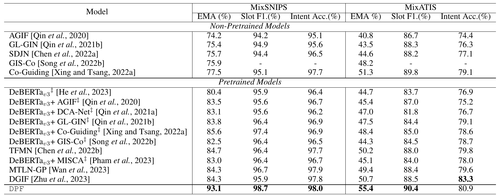

# _Decoupling breaks data barriers:_ A  Decoupled Pre-training Framework for Multi-Intent Spoken Language Understanding

---

<p align="center">
  	<a href='https://arxiv.org/pdf/2403.18814.pdf'></a>
  <a href=""></a>
  <a >
       
  	</a>
   	<a>
       
  	</a>
  	<a href="https://github.com/LightChen233/OpenSLU/network/members">
       
  	</a>
    <br />
</p>

<div>


</div>

> 🔥 Official implementation for "_Decoupling breaks data barriers:_ A  Decoupled Pre-training Framework for Multi-Intent Spoken Language Understanding".

##   Motivation

Multi-intent Spoken Language Understanding (Multi-intent SLU) can extract multiple intents in a single utterance, gaining increasing attention.
Nevertheless, current multi-intent SLU approaches still heavily rely on large amounts of annotated multi-intent SLU data, which makes it hard to be satisfied in real-world scenarios without sufficient data.

Motivated by this, we introduce a novel decoupled pre-training framework (**DPF**) to address the data-scarcity problem, achieving to leverage of abundant multi-intent-free SLU data  to enhance multi-intent SLU. 
Specifically, **DPF** first decouples the multi-intent SLU task into two abilities: (1) _task-agnostic ability_ to locate the task-agnostic slot entity span and (2) _task-specific ability_ to predict the task-specific slot and intent labels simultaneously.
The key insight of **DPF** is that such decomposition allows us to design a two-stage decoupled pre-training procedure to enhance both _task-agnostic ability_ and _task-specific ability_ with abundant multi-intent-free SLU data (i.e., NER and single-intent SLU data), respectively.

Experimental results on two standard benchmarks (e.g., {MixATIS} and {MixSNIPS}) demonstrate the effectiveness of **DPF** by achieving superior performance. In addition, extensive analyses reveal that utilizing the multi-intent-free data can effectively enhance multi-intent SLU.

##  Reference

If you find this project useful for your research, please consider citing the following paper:

```
@inproceedings{qin-etal-2023-openslu,
    title = "{O}pen{SLU}: A Unified, Modularized, and Extensible Toolkit for Spoken Language Understanding",
    author = "Qin, Libo  and
      Chen, Qiguang  and
      Xu, Xiao  and
      Feng, Yunlong  and
      Che, Wanxiang",
    booktitle = "Proceedings of the 61st Annual Meeting of the Association for Computational Linguistics (Volume 3: System Demonstrations)",
    month = jul,
    year = "2023",
    address = "Toronto, Canada",
    publisher = "Association for Computational Linguistics",
    url = "https://aclanthology.org/2023.acl-demo.9",
    doi = "10.18653/v1/2023.acl-demo.9",
    pages = "95--102",
}
```


##  Installation
### System requirements
OpenSLU requires `Python>=3.8`, and `torch>=1.12.0`.
### Install from git
```bash 
git clone https://github.com/LightChen233/OpenSLU.git && cd OpenSLU/
pip install -r requirements.txt
```

### Downloading Pretrained Model
Due to the restrictions of the open source agreement, we cannot open source the pre-training data. However, you can download our pre-trained models from different stages at  [TAAP]() and [TSAP]().

Please put the model in the `save/dpf/taap/ckpt-155000` and `save/dpf/tsap/ckpt-45000` directories.
##  Pre-Training (Optional)

### 1. Collecting Data
**Download:** Due to the restrictions of the open source agreement, we cannot distribute the integrated results. Please download the dataset at the url provided in the original paper.

**Process:** Please process it into [OpenSLU](https://github.com/LightChen233/OpenSLU) format.

**Position:**
- Please put TAAP data in the following paths: `dataset/taap/train.jsonl` and `dataset/taap/dev.jsonl`.
- Please put TSAP data in the following paths: `dataset/tsap/train.jsonl` and `dataset/tsap/dev.jsonl`.

### 2. Training for TAAP

First, you need to pre-train on the TAAP data:
```bash
python run.py -cp config/reproduction/dpf/run_taap.yaml
```
The model will be saved in the `save/taap` path.

Secondly, you need to clean the classification header of the TAAP model:
```bash
python tools/clean_classifier.py --load_dir save/dpf/taap/ckpt-155000 \
                    --save_dir save/dpf/taap/ckpt-155000 
```


### 3. Training for TSAP
```bash
python run.py -cp config/reproduction/dpf/run_tsap.yaml
```


##  Downstream Finetuning

### 1. Finetuning on MixATIS
```bash
python run.py -cp config/reproduction/dpf/run_mix-atis.yaml
```

### 2. Finetuning on MixSNIPS
```bash
python run.py -cp config/reproduction/dpf/run_mix-snips.yaml
```

##  Experiments




---
**\* NOTE:** Due to some stochastic factors(e.g., GPU and environment), it maybe need to slightly tune the hyper-parameters using grid search to obtain better results.


##  Contact

Please create Github issues here or email [Libo Qin](mailto:lbqin@ir.hit.edu.cn) or [Qiguang Chen](mailto:charleschen2333@gmail.com) if you have any questions or suggestions. 


## Acknowledgement
Our codes are adapted from [OpenSLU](https://github.com/LightChen233/OpenSLU).
